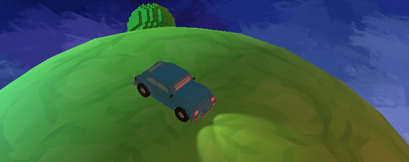
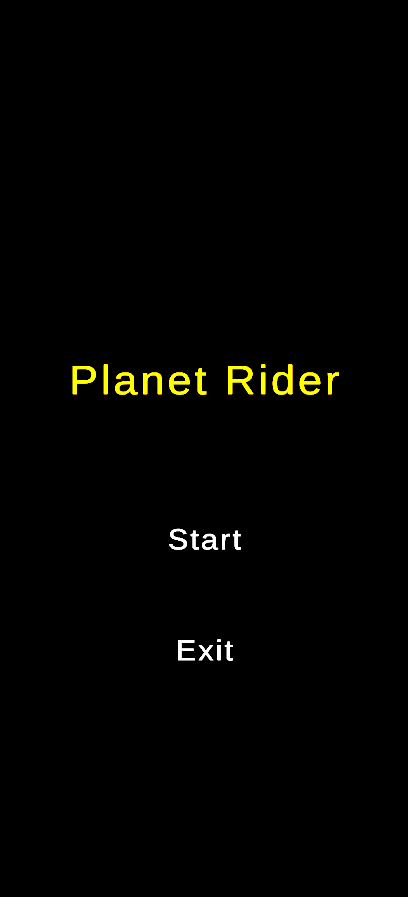
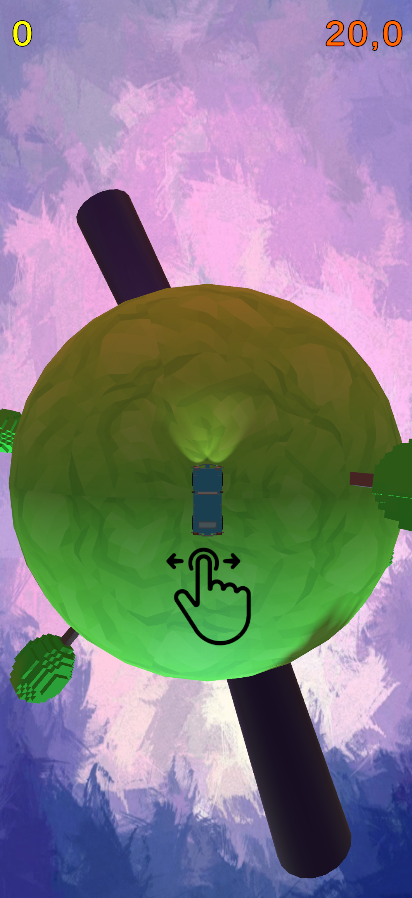
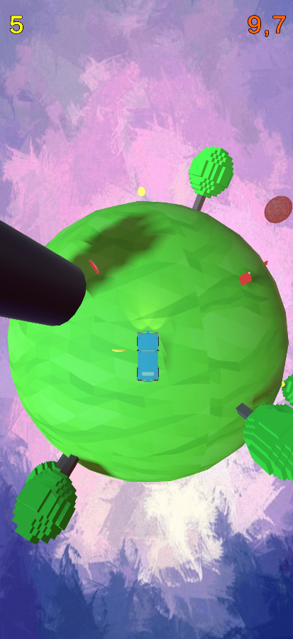
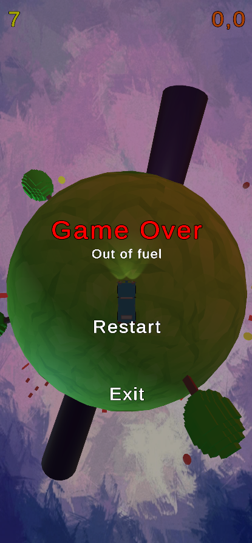

# Planet Rider

You are on a very small planet in a car that is almost out of fuel. But you need to ride! Collect fuel, avoid obstacles and meteors, collect coins. Don't stop. Let's see how many you can collect!
  
This game is inspired by Brackeys video [Making of SHRINKING PLANET](https://youtu.be/XldCg9sQYx0). I wanted to create something simular to it and play around with Zenject and UniRX.

### Download
[PlanetRider.apk](TODO)

### Gameplay Video
[YouTube](https://youtu.be/4pgQJndekcA)
  
### Gameplay Screenshorts

### Used Assets
Music: https://ansimuz.itch.io/action-music-pack-1  
Car model: https://casaga.itch.io/classic-voxel-beetle  
Trees model: https://theodd1in.itch.io/voxel-trees  
